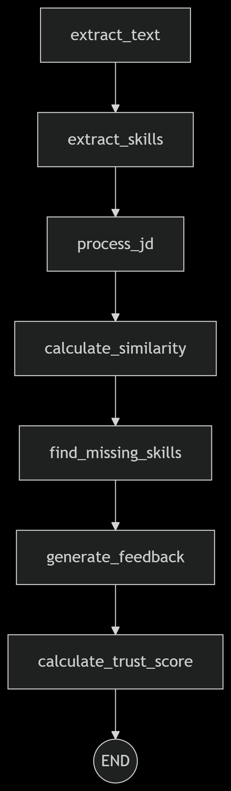

# RAGcruit.  
Dynamic RAG system for automated resume screening and ranking using Google Gemini, LangGraph, and FAISS.  

## Features.  
- PDF content extraction.  
- Skill/experience detection.  
- Job description matching.  
- Custom similarity metrics.  
- Improvement suggestions.  
- Trust score calculation.  
- Multi-resume ranking system.  
- Candidate name extraction.  
- Batch processing of resumes.  


## Tech Stack.  
- **LLM**: Google Gemini Pro.  
- **Framework**: LangGraph.  
- **Backend**: FastAPI.  
- **Frontend**: Streamlit.  
- **Vector Store**: FAISS.  
- **PDF Processing**: PyPDF.  

## Key Functionalities.  
1. **Resume Screening**.  
   - Extracts text and analyzes PDF resumes.  
   - Compares against job descriptions.  
   - Generates trust and similarity scores.  
   - Identifies missing and matching skills.  

2. **Resume Ranking**.  
   - Processes multiple resumes simultaneously.  
   - Extracts candidate names automatically.  
   - Ranks candidates by trust and fit scores.  
   - Provides comparative analysis of candidates.  
   - Generates unified missing skills report.  

3. **Name Extraction**.  
   - Uses regex patterns and LLM fallback.  
   - Handles various resume formats.  
   - Returns clean candidate names.  

## Setup.  

1. Install backend dependencies.  
```bash.  
cd backend.  
pip install -r requirements.txt.  
```.  

2. Configure environment variables.  
   - Set GOOGLE_API_KEY for Gemini access.  
   - Configure LLM_MODEL in settings.  

